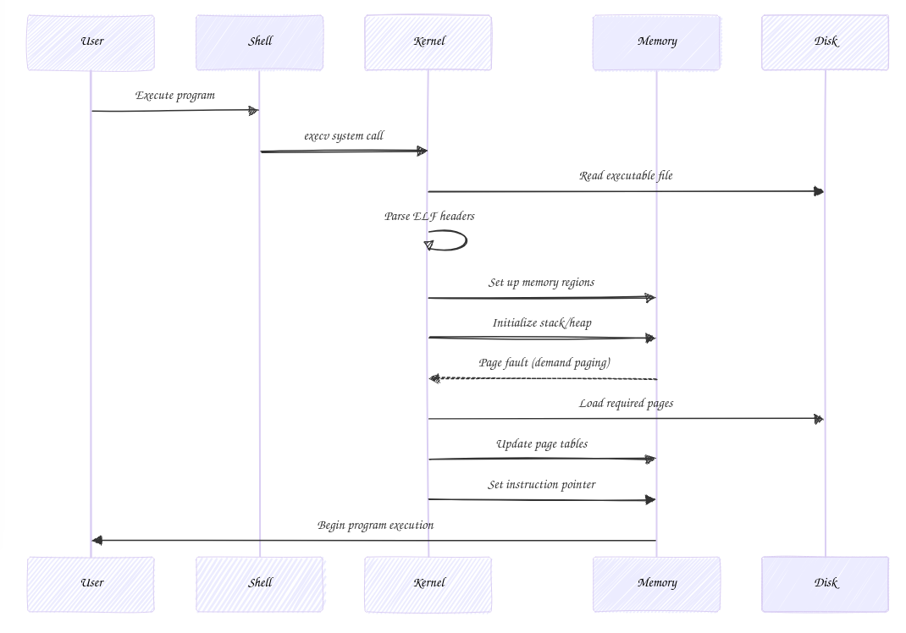

# Understanding Linux Executable Loading: A Deep Dive into Kernel Internals

## Introduction

The process of loading and executing programs in Linux is a fascinating journey through the kernel's internals. This blog post explores the intricate mechanisms behind program execution, from the moment a user initiates a program to its actual execution in memory. We'll dive deep into system calls, ELF file handling, and the kernel's role in managing program execution.

## The Journey Begins: System Calls and Program Execution



### The execv System Call

At the heart of program execution in Linux lies the `execv` system call. This fundamental system call is responsible for replacing the current process's image with a new program. Let's explore how this works with a practical example.

Here's a simple implementation demonstrating the use of `execv`:

```c
#include <unistd.h>
#include <stdio.h>
#include <errno.h>

int main(int argc, char *argv[]) {
    char *new_argv[] = { "/usr/bin/whoami", NULL };
    char *new_envp[] = { NULL };

    // Attempt to execute the new program
    int result = execv(new_argv[0], new_argv);
    
    // If execv returns, an error occurred
    if (result == -1) {
        perror("execv failed");
        return 1;
    }
    
    // This code is never reached if execv succeeds
    return 0;
}
```

To compile this program:
```bash
gcc -o execv_example execv_example.c
```

When executed, this program will:
1. Replace itself with the `whoami` command
2. Print the current username to stdout
3. If execv fails, print an error message

Let's examine the assembly code for the key system call:

```bash
objdump -d execv_example | grep -A10 main.:
```

The important assembly instructions include:
- The system call number being loaded into `rax`
- Arguments being placed in registers according to the System V AMD64 ABI
- The `syscall` instruction that transfers control to the kernel

### Kernel's Perspective: Handling execv

When the kernel receives the `execv` system call, it initiates a complex sequence of operations:

1. **Parameter Validation**
   - Verifies file path existence
   - Checks permissions
   - Validates argument and environment arrays

2. **Binary Format Detection**
   - Examines file headers
   - Determines executable format (ELF, script, etc.)
   - Selects appropriate handler

## Deep Dive: ELF Binary Loading

### ELF File Structure and Parsing

The Executable and Linkable Format (ELF) is the standard binary format for Linux executables. Let's create a minimal program to examine its ELF structure:

```c
#include <unistd.h>

int main() {
    const char message[] = "Hello from ELF!\n";
    write(1, message, sizeof(message) - 1);
    return 0xa4;  // Distinctive return value
}
```

Compile it statically to examine the pure ELF structure:
```bash
gcc -static -o elf_example elf_example.c
```

Let's create a program to read and parse basic ELF headers:

```c
#include <stdio.h>
#include <stdlib.h>
#include <fcntl.h>
#include <unistd.h>
#include <elf.h>
#include <sys/stat.h>
#include <sys/mman.h>

void analyze_elf(const char *filepath) {
    int fd = open(filepath, O_RDONLY);
    if (fd < 0) {
        perror("Failed to open file");
        return;
    }

    struct stat st;
    fstat(fd, &st);
    
    void *map = mmap(NULL, st.st_size, PROT_READ, MAP_PRIVATE, fd, 0);
    if (map == MAP_FAILED) {
        perror("Failed to map file");
        close(fd);
        return;
    }

    Elf64_Ehdr *ehdr = (Elf64_Ehdr *)map;
    
    // Verify ELF magic number
    if (ehdr->e_ident[EI_MAG0] != ELFMAG0 ||
        ehdr->e_ident[EI_MAG1] != ELFMAG1 ||
        ehdr->e_ident[EI_MAG2] != ELFMAG2 ||
        ehdr->e_ident[EI_MAG3] != ELFMAG3) {
        printf("Not a valid ELF file\n");
        goto cleanup;
    }

    printf("ELF Analysis:\n");
    printf("Entry point: 0x%lx\n", ehdr->e_entry);
    printf("Program header offset: %lu\n", ehdr->e_phoff);
    printf("Section header offset: %lu\n", ehdr->e_shoff);
    printf("Number of program headers: %d\n", ehdr->e_phnum);
    printf("Number of section headers: %d\n", ehdr->e_shnum);

cleanup:
    munmap(map, st.st_size);
    close(fd);
}

int main(int argc, char *argv[]) {
    if (argc != 2) {
        fprintf(stderr, "Usage: %s <elf_file>\n", argv[0]);
        return 1;
    }
    
    analyze_elf(argv[1]);
    return 0;
}
```

Compile the ELF analyzer:
```bash
gcc -o elf_analyzer elf_analyzer.c
```

## Memory Management and Program Loading

### Demand Paging

One of the most interesting aspects of program loading is demand paging. Let's create a program to demonstrate this concept:

```c
#include <stdio.h>
#include <stdlib.h>
#include <unistd.h>
#include <sys/mman.h>

#define PAGE_SIZE 4096

int main() {
    // Allocate a large array but don't touch it yet
    char *large_array = mmap(NULL, 100 * PAGE_SIZE, 
                           PROT_READ | PROT_WRITE,
                           MAP_PRIVATE | MAP_ANONYMOUS, -1, 0);
    
    if (large_array == MAP_FAILED) {
        perror("mmap failed");
        return 1;
    }

    printf("Memory mapped. Press Enter to access pages...\n");
    getchar();

    // Access pages one at a time
    for (int i = 0; i < 100; i++) {
        large_array[i * PAGE_SIZE] = 1;
        printf("Accessed page %d\n", i);
        usleep(100000);  // Sleep to make the effect visible
    }

    munmap(large_array, 100 * PAGE_SIZE);
    return 0;
}
```

Compile with debugging symbols:
```bash
gcc -g -o demand_paging demand_paging.c
```

## Kernel Debugging Setup

### Building a Debuggable Kernel

To effectively debug the kernel, we need to build it with debugging symbols and certain configurations:

1. Required Kernel Configuration Options:
   - CONFIG_DEBUG_INFO=y
   - CONFIG_GDB_SCRIPTS=y
   - CONFIG_KGDB=y
   - CONFIG_RANDOMIZE_BASE=n

2. Essential Build Commands:
```bash
make defconfig
make menuconfig  # Enable debug options
make -j$(nproc)
make scripts_gdb
```

### Creating a Minimal Test Environment

Let's create a minimal init program for testing:

```c
#include <stdio.h>
#include <unistd.h>
#include <sys/wait.h>

int main() {
    printf("Init starting...\n");
    
    while (1) {
        pid_t pid = fork();
        
        if (pid < 0) {
            perror("fork failed");
            continue;
        }
        
        if (pid == 0) {
            // Child process
            execl("/bin/sh", "sh", NULL);
            perror("execl failed");
            _exit(1);
        }
        
        // Parent process
        int status;
        waitpid(pid, &status, 0);
        printf("Child process exited with status %d\n", 
               WEXITSTATUS(status));
    }
    
    return 0;
}
```

Compile statically:
```bash
gcc -static -o init init.c
```

### Further Reading
For more detailed information:

1. The Linux Programming Interface by Michael Kerrisk
2. Linux Kernel Development by Robert Love
3. Understanding the Linux Kernel by Daniel P. Bovet
4. Intel® 64 and IA-32 Architectures Software Developer's Manual

### Conclusion
Understanding how Linux loads and executes programs provides deep insights into operating system internals. This knowledge is invaluable for systems programmers, security researchers, and anyone interested in low-level software development. The combination of system calls, memory management, and binary formats creates a sophisticated yet elegant system for program execution.
Whether you're debugging kernel issues, developing system utilities, or just satisfying your curiosity about operating system internals, understanding these concepts is crucial. The practical examples and debugging techniques covered here should give you a solid foundation for further exploration and development in this space.